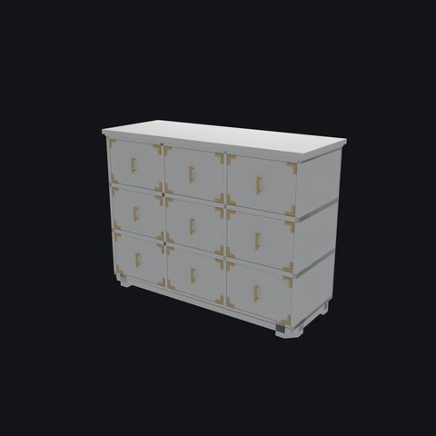
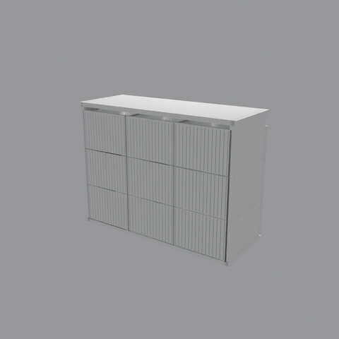
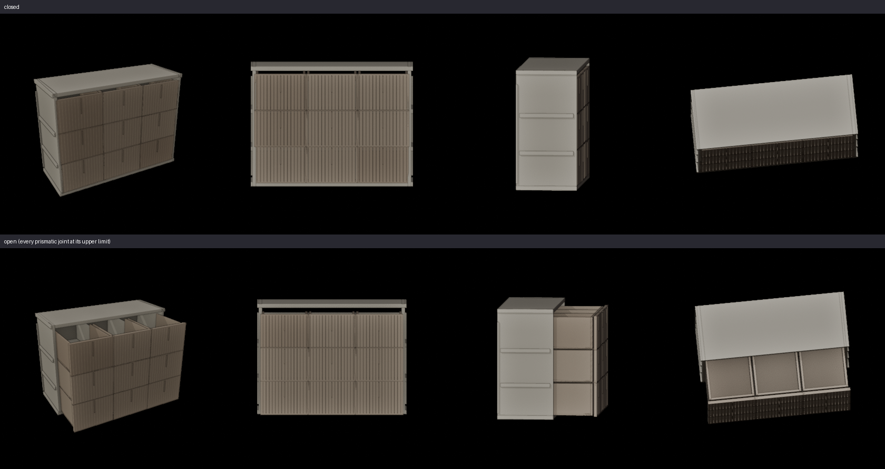
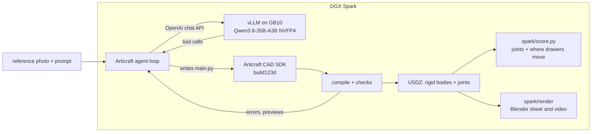

# Articraft on a DGX Spark

**A reference photo in, an articulated 3D asset out, on one NVIDIA DGX Spark with an open-weight
model. No API key and no cloud once the weights are downloaded.**

## Latest — 2026-09-12: a second local model built the dresser

**[Qwen3.8-Flash-Next](https://huggingface.co/Qwen/Qwen3.8-Flash-Next) drove this loop on one Spark**, from
the same photo and the same one-paragraph prompt as the dresser below. It is served by
**[blazux/qwen3.8-Flash-DGX](https://github.com/blazux/qwen3.8-Flash-DGX)** — about 135 GB of weights in
NVFP4 do not fit on a 121 GB Spark under stock vLLM, and their patched build is what makes it run here.



*Qwen3.8-Flash-Next, 2026-09-11: **77 turns in 101 minutes, ended on its own final response** — and this is
that run's own last revision, not a good step picked out of one. Nine prismatic joints, every slide
horizontal and opening out of the front (`spark/score.py`: 9/9 and 9/9), every handle proud of its drawer
front (`spark/handles.py`: 9/9). The fronts read better than the dresser below's; the sides of neither are
right, with the drawer rails running out to the outside of the side panels on both.*

On that server the model was ready in 752 s and decoded at 15.95 tok/s, and no source change was needed to
drive it.

**2026-09-12 — it now holds over a registered pair, not one run.** Two draws at `reasoning_effort: medium`,
on one server instance with no reload between them and predictions written before either started: **both
produced a coherent dresser**, 64 turns in 1 h 57 m and 56 turns in 64 min, both ending on their own final
response. Every revision either run produced passes all three automated checks — `spark/score.py` 9/9 and 9/9,
`spark/handles.py` 9/9 proud, and a `pxr` placement read putting 9/9 drawers inside the carcass. The sample is
[`spark/results/dresser-flash-next-medium/`](spark/results/dresser-flash-next-medium/).

**And a second local model cleared the same bar the same night.** `Inferact/Qwen3.8-27B-NVFP4` — **~26 GB of
weights on the pinned upstream vLLM image, no patched build** — produced a coherent dresser in **39 turns and
1 h 34 m**: [`spark/results/dresser-qwen3.8-27b-medium/`](spark/results/dresser-qwen3.8-27b-medium/). It decodes
at **half** Flash-Next's speed (8.4 against 16.2 tok/s) and still finishes sooner, because it spends 45,547
output tokens where Flash-Next spends 109,283. **Run time here is output tokens ÷ decode rate**, and in all four
draws 95–98 % of the wall was the model emitting tokens.

**The setting is the whole difference, and the cheap-looking one is not cheap.** At `reasoning_effort: low`
Flash-Next ran 98 turns without once calling `compile` and produced nothing — and spent **51 % more output
tokens** (136,463) doing so.

**What the checks do not see.** A human review of all four sheets rated them *"very good"*, *"good but feet missing
at bottom"*, *"good but top and sides have underlying geometry slightly pushing through"*, *"poor — missing
cavity on drawers"*. **All four passed `score.py`, `handles.py` and the placement read identically.** Missing
feet and surfaces punching through another part are not something any check here looks at. Two of four draws
would be called good by a person; the automated legs cannot tell you which two.

[Articraft](https://github.com/articraftresearch/Articraft) is an agent that turns a prompt or a
reference photo into a posable 3D object. A language model writes Python against Articraft's CAD SDK;
Articraft compiles it, checks it, and exports a USDZ with rigid bodies and joints. Upstream expects a
frontier API behind that loop. This fork runs the same loop against a model served on the Spark itself:
[`RedHatAI/Qwen3.6-35B-A3B-NVFP4`](https://huggingface.co/RedHatAI/Qwen3.6-35B-A3B-NVFP4), a 35B
mixture-of-experts with 3B active parameters, quantized to NVFP4 for Blackwell and served by vLLM on the
GB10.



*Built on the Spark by the local Qwen3.6 through this fork, from the photo and the one-paragraph prompt in `spark/bench/dresser/` (see Results).*

## Why

This is one piece of **scenewright**, a pipeline on the same Spark that turns a photo or a prompt into
a Blender room (not public yet). Every object it reconstructs is a single scanned mesh, so a dresser
arrives as one frozen shape. Articraft builds the replacement: the same kind of object as rigid
bodies and joints. scenewright can swap one in by name from its Articraft library, which is how the
dresser above ends up in its living room with drawers that open. (In the video the dresser's facing was
set by hand; turning a swapped asset to face the room automatically is still open work in scenewright.)

## Run it

On a DGX Spark with Docker and the NVIDIA container toolkit:

```shell
spark/install.sh                             # uv venv: Python 3.12, this repo, and OpenUSD; re-runnable
spark/serve.sh qwen3.6-35b-a3b-nvfp4         # vLLM in Docker on :8001; the first start downloads 24 GB of weights
spark/demo_dresser.sh qwen3.6-35b-a3b-nvfp4  # build the nine-drawer dresser from one photo, score it, render it
```

The demo sends the one-paragraph prompt in [`spark/bench/dresser/prompt_demo.txt`](spark/bench/dresser/prompt_demo.txt)
and the photo beside it (`PROMPT=frozen` sends the short benchmark prompt instead), waits for the agent
(about an hour on a Spark), then prints a score and, with Blender available (`BLENDER=/path/to/blender`), writes `render/sheet.png` next to the run. Every input is
checked against `SHA256SUMS` first, so a changed prompt cannot pass for a better model.

### Starting from an empty folder, or reusing weights you already have

[`spark/clone_and_demo.sh`](spark/clone_and_demo.sh) does the clone, `install.sh`, `serve.sh` and
`demo_dresser.sh` above in one command, and never downloads weights silently:

```shell
./clone_and_demo.sh qwen3.6-35b-a3b-nvfp4 ~/.cache/huggingface   # <model-key> <hf-cache-dir> [demo|frozen]
```

It's standalone, so you don't need a checkout first — fetch just the script:

```shell
curl -O https://raw.githubusercontent.com/gregcockroft/articraft-spark/main/spark/clone_and_demo.sh
chmod +x clone_and_demo.sh
./clone_and_demo.sh qwen3.6-35b-a3b-nvfp4 /path/to/your/hf-cache
```

Run it from an empty folder — it clones this repo into `./articraft-spark` under wherever you run it
and refuses to run if that folder already exists. The second argument is an `HF_CACHE` directory (e.g.
your existing `~/.cache/huggingface`): `spark/cache.sh` checks it first and **aborts before starting
anything** if the model's weights aren't already there, rather than downloading ~25–135 GB silently —
point it at a cache that has them, or run `spark/cache.sh <model-key> --fetch` yourself first. It also
reuses an already-running compatible server on the target port instead of restarting one, and renders
automatically (`render/sheet.png`) if Blender is on `PATH`, `$BLENDER` is set, or it finds one in a
couple of common local install spots. A third argument picks the `demo` (default) or `frozen` prompt;
`FRESH_USD=1` forces a from-source OpenUSD build instead of reusing one already on the box.

## What had to change

A local model behind an OpenAI-compatible server behaves in ways a hosted API hides. Six changes,
each a commit on top of Articraft `ac7d688`:

| commit | the problem on the Spark | the change |
|---|---|---|
| Build on aarch64 Linux | `usd-core` publishes no aarch64 wheel and no sdist at any version, so Articraft would not install | `spark/build_openusd.sh` builds OpenUSD v26.05 from source in ~4 min (no imaging; no sudo) |
| Drive a local OpenAI-compatible server | three separate layers assumed openrouter.ai: the endpoint, a required API key, and a text-only CLI | a base URL, a key only where one is needed, and opt-in image input for vision models |
| Survive a local reasoning model | a thinking-only turn was a fatal error; a turn could generate ~49k tokens with no tool call; thinking could not be switched off; images piled up until the server refused the request | empty turns flow into the loop's normal handling; an output cap; chat-template arguments (`enable_thinking`); image-history pruning that always keeps the reference photo |
| Bound the thinking per turn | with thinking on, Qwen reasoned for the full 32k-token cap three turns running without a tool call, and the harness stopped the run; vLLM's own `thinking_token_budget` is accepted and ignored on this server | the client closes the reasoning after N tokens (8,192 here) and asks for the action, and the model acts on the plan it has |
| Keep the last clean compile at the turn limit | the local model keeps revising until the turn ceiling, and a run that had compiled a good revision recorded nothing | the last clean revision is kept and the record says it was salvaged (`max_turns_last_clean`) |
| Edit, do not rewrite | the model replaced a whole 300-line file to change a few lines, turn after turn; five such `write` calls were most of one run's output growth, and every recorded draw had at least one | `write` refuses a small rewrite (under 40 % of lines changed) of a file this run already wrote and points at `edit`; measured on a Flash-Next pair, 2 of 2 coherent, the model complied on the next turn both times |

Every new setting is off by default, so nothing changes for hosted providers. The tests are in
`tests/test_openrouter_local.py`.

## Check the results without a Spark

The numbers below come from a small number of runs on one machine. That is a reason to make them
checkable, not a reason to trust them. Each recorded run in [`spark/results/`](spark/results/)
carries the USDZ it produced, so its geometry claims can be re-derived from files in this
repository — no GPU, no model, no server, no network, about ten seconds:

```shell
spark/verify_results.sh          # after spark/install.sh
```

It checks each sample against its `SHA256SUMS`, then re-runs [`spark/score.py`](spark/score.py) and
[`spark/handles.py`](spark/handles.py) on the committed USDZ and requires them to reproduce the
committed `score.txt` and `handles.txt` line for line. Two lines are excluded on both sides, both
provenance rather than geometry: `file`, which names the path the run happened at, and `record`,
present only when the scorer was pointed at a run directory. If a published number is wrong, the
script says so and exits non-zero.

One run also publishes its turn-by-turn log —
[`conversation.jsonl`](spark/results/dresser-flash-next-medium/conversation.jsonl), 147 messages as
the harness wrote them, with every tool call and every turn's token usage.
[`spark/verify_run.py`](spark/verify_run.py) re-derives the turn count, both token totals, the peak
turn and the compile turn from that log and checks them against the `stats.json` the tooling wrote.
All six agree: **64 turns, 109,283 output tokens, 6,127,645 input, peak 199,782, one `compile`, at
turn 62.**

**What none of it checks is whether the object looks like the photo.** No script here does; that is
what the sheets and the human reads are for, and it is the limit that decided four runs above.

## Results

Measured on one DGX Spark (GB10, 128 GB unified memory) on 2026-09-10. Warm decode on this server is
about 27 tok/s at a 57k-token prompt.

### The demo run



This fork, thinking on with the 8,192-token budget, the one-paragraph prompt: **67 turns in 53 minutes,
finished on its own final response.** Revision `0002` has nine prismatic joints, every slide horizontal and
opening out of the front (`spark/score.py`: 9/9 and 9/9), and every handle standing proud of its drawer
front (`spark/handles.py`: 9/9). The run's last revision, `0004`, thickened the fronts past the handles, so
`0002` is the sample; [its directory](spark/results/dresser-current-harness-thinking-budget/) has the details.

### The benchmark prompt

The short prompt in `spark/bench/dresser/prompt.txt` is the one every earlier run was given, and the one the
rows below share. Do not compare them with the demo run above: the prompts differ.

**The joint count is not the object.** Articraft's checks and the bench's joint ask both passed on
objects whose parts do not fit together. With thinking switched off, the local model is fast (turns of
10 to 20 seconds) and hits the ask on three of five objects, but none of the five holds together: in the
dresser the drawers slide vertically and a side panel sits in the middle of the carcass. So
[`spark/score.py`](spark/score.py) also checks every drawer in world space: its slide axis has to be
horizontal and opening it has to move it out of the carcass, not through it.


| dresser run | harness | thinking | turns | wall | joints (ask: 9 prismatic) | score.py geometry |
|---|---|---|---|---|---|---|
| [earlier Articraft](spark/results/dresser-pinned-harness-thinking-on/) | `mattzh72/articraft` `959f1455` | on | 65, finished on its own | 50 min | 9 prismatic, met | **pass**: 9/9 horizontal, 9/9 open outward |
| [current, thinking off](spark/results/dresser-current-harness-thinking-off/) | this fork | off | 100, salvaged | 27 min | 9 prismatic, met | **fail**: 0/9 horizontal |
| current, thinking on | this fork | on | 4, stopped by the harness | 36 min | never compiled | none |
| current, thinking on, budget | this fork | on, 8,192 budget | 60, finished on its own | 22 min | 9 joints, 0 prismatic, not met | none to check |

With thinking on and no budget, turns 2, 3 and 4 each reasoned for the full 32,768-token cap without calling
a tool, and after three empty turns in a row the harness stopped the run. With the budget the runaway is
gone: the run finished on its own, but from the short prompt the drawers came out as removable parts rather
than slides. The demo prompt, which names the slides, the handles and every carcass part, is what produced
the dresser above.

## Try another model

Each model is one file in [`spark/models/`](spark/models/): the vLLM image digest, the checkpoint and
revision, the tool-call and reasoning parsers, and the client settings Articraft sends. To try one:

```shell
cp spark/models/qwen3.6-35b-a3b-nvfp4.env spark/models/my-model.env   # edit it
spark/serve.sh my-model && spark/demo_dresser.sh my-model
```

`qwen3.8-27b.env` is there as the next slot and is marked untested. What decides whether a model can
drive Articraft at all is whether its tool calls parse, and whether it acts before its output cap.

## How it fits together



## Limits

- **Thinking needs a budget.** Off, the model is quick and the geometry did not hold together in these runs.
  On with no budget, it reasoned to the 32k-token cap three turns running without acting. On with an 8,192-token
  budget, it thinks and then acts. vLLM's own `thinking_token_budget` has no effect on this server (MTP-2), so
  the budget is enforced by the client.
- **The prompt carries a lot.** The same model on the same code built nine sliding drawers from the demo prompt
  and none from the short one. Both prompts are in `spark/bench/dresser/`.
- **The last clean revision is not always the best.** In the demo run the final revision moved the drawer fronts
  past the handles; the checks in `spark/` are how the good revision was picked.
- **The geometry checks are narrow.** `score.py` checks sliding joints and `handles.py` checks handles. Hinges,
  and whether the object resembles the photo, still need a person looking at the render.

## Credits

Articraft is by its authors at [articraftresearch/Articraft](https://github.com/articraftresearch/Articraft),
Apache-2.0; its README is kept as [ARTICRAFT.md](ARTICRAFT.md), and [NOTICE](NOTICE) lists what this
fork changed. Qwen3.6 and Qwen3.8-Flash-Next are by the Qwen team; their NVFP4 checkpoints are by
[Red Hat AI](https://huggingface.co/RedHatAI) and [RadixArk](https://huggingface.co/RadixArk);
serving is [vLLM](https://github.com/vllm-project/vllm), and fitting Flash-Next onto one Spark is
[blazux/qwen3.8-Flash-DGX](https://github.com/blazux/qwen3.8-Flash-DGX).
