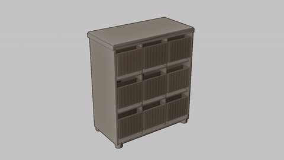
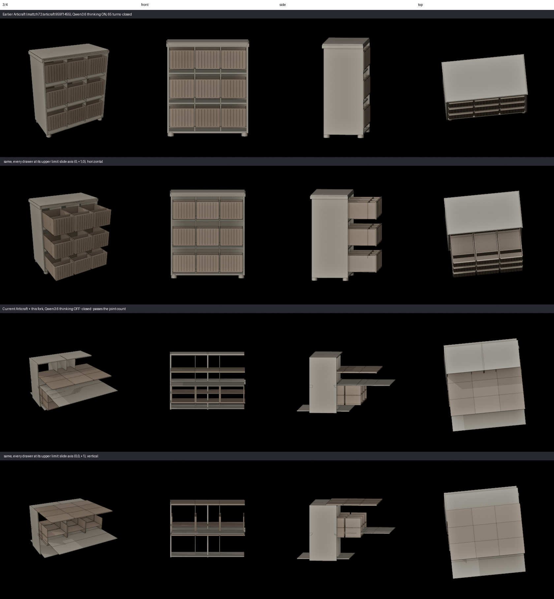
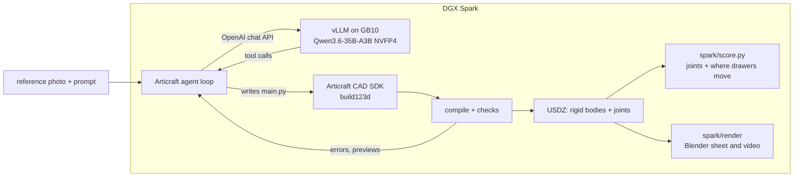

# Articraft on a DGX Spark

**A reference photo in, an articulated 3D asset out, on one NVIDIA DGX Spark with an open-weight
model. No API key and no cloud once the weights are downloaded.**

[Articraft](https://github.com/articraftresearch/Articraft) is an agent that turns a prompt or a
reference photo into a posable 3D object. A language model writes Python against Articraft's CAD SDK;
Articraft compiles it, checks it, and exports a USDZ with rigid bodies and joints. Upstream expects a
frontier API behind that loop. This fork runs the same loop against a model served on the Spark itself:
[`RedHatAI/Qwen3.6-35B-A3B-NVFP4`](https://huggingface.co/RedHatAI/Qwen3.6-35B-A3B-NVFP4), a 35B
mixture-of-experts with 3B active parameters, quantized to NVFP4 for Blackwell and served by vLLM on the
GB10.



*Built by the local Qwen3.6 on the Spark from the photo and prompt in `spark/bench/dresser/`, on the earlier Articraft codebase (see Results).*

**Where it stands.** The whole loop runs on the Spark against current Articraft: the local model reads the
photo, writes the CAD program, compiles it and exports a USDZ with the right joint types. On the earlier
Articraft codebase the same model built the coherent chest above. On current Articraft it does not yet: with
thinking off its parts do not fit together, and with thinking on it deliberates without acting. Both are
measured below, and `spark/score.py` exists so a joint count cannot hide the first.

## Run it

On a DGX Spark with Docker and the NVIDIA container toolkit:

```shell
spark/install.sh                             # micromamba env: Python 3.12, OpenUSD from conda-forge, this repo
spark/serve.sh qwen3.6-35b-a3b-nvfp4         # vLLM in Docker on :8001; the first start downloads 24 GB of weights
spark/demo_dresser.sh qwen3.6-35b-a3b-nvfp4  # build the nine-drawer chest from one photo, score it, render it
```

The demo sends the prompt in [`spark/bench/dresser/prompt.txt`](spark/bench/dresser/prompt.txt) and the
photo beside it, waits for the agent (half an hour to a few hours), then prints a score and, with Blender
available (`BLENDER=/path/to/blender`), writes `render/sheet.png` next to the run. Every input is
checked against `SHA256SUMS` first, so a changed prompt cannot pass for a better model.

## What had to change

A local model behind an OpenAI-compatible server behaves in ways a hosted API hides. Four changes,
each a commit on top of Articraft `ac7d688`:

| commit | the problem on the Spark | the change |
|---|---|---|
| Build on aarch64 Linux | `usd-core` has no aarch64 Linux wheel, so Articraft would not install | OpenUSD comes from conda-forge's `openusd` on aarch64 |
| Drive a local OpenAI-compatible server | three separate layers assumed openrouter.ai: the endpoint, a required API key, and a text-only CLI | a base URL, a key only where one is needed, and opt-in image input for vision models |
| Survive a local reasoning model | a thinking-only turn was a fatal error; a turn could generate ~49k tokens with no tool call; thinking could not be switched off; images piled up until the server refused the request | empty turns flow into the loop's normal handling; an output cap; chat-template arguments (`enable_thinking`); image-history pruning that always keeps the reference photo |
| Keep the last clean compile at the turn limit | the local model keeps revising until the turn ceiling, and a run that had compiled a good revision recorded nothing | the last clean revision is kept and the record says it was salvaged (`max_turns_last_clean`) |

Every new setting is off by default, so nothing changes for hosted providers. The tests are in
`tests/test_openrouter_local.py`.

## Results

Measured on one DGX Spark (GB10, 128 GB unified memory) on 2026-09-10. Warm decode on this server is
about 27 tok/s at a 57k-token prompt.

**The joint count is not the object.** Articraft's checks and the bench's joint ask both passed on
objects whose parts do not fit together. With thinking switched off, the local model is fast (turns of
10 to 20 seconds) and hits the ask on three of five objects, but none of the five holds together: in the
dresser the drawers slide vertically and a side panel sits in the middle of the carcass. So
[`spark/score.py`](spark/score.py) also checks every drawer in world space: its slide axis has to be
horizontal and opening it has to move it out of the carcass, not through it.



| dresser run | harness | thinking | turns | wall | joints (ask: 9 prismatic) | score.py geometry |
|---|---|---|---|---|---|---|
| [earlier Articraft](spark/results/dresser-pinned-harness-thinking-on/) | `mattzh72/articraft` `959f1455` | on | 65, finished on its own | 50 min | 9 prismatic, met | **pass**: 9/9 horizontal, 9/9 open outward |
| [current, thinking off](spark/results/dresser-current-harness-thinking-off/) | this fork | off | 100, salvaged | 27 min | 9 prismatic, met | **fail**: 0/9 horizontal |
| current, thinking on | this fork | on | 4, stopped by the harness | 36 min | never compiled | none |

With thinking on, the current harness never reached a compile. Turns 2, 3 and 4 each reasoned for the full
32,768-token cap without calling a tool, each starting over from the photo and writing the program inside its
thinking, and after three empty turns in a row the harness stopped the run. On the earlier codebase, with the
same model, thinking setting and cap, the largest single generation was 18,806 tokens and the model acted.

All five bench objects with thinking off, for scale: four produced an artifact, three met their joint
ask, the arm never compiled clean, and none is a coherent object.

## Try another model

Each model is one file in [`spark/models/`](spark/models/): the vLLM image digest, the checkpoint and
revision, the tool-call and reasoning parsers, and the client settings Articraft sends. To try one:

```shell
cp spark/models/qwen3.6-35b-a3b-nvfp4.env spark/models/my-model.env   # edit it
spark/serve.sh my-model && spark/demo_dresser.sh my-model
```

`qwen3.8-27b.env` is there as the next slot and is marked untested. What decides whether a model can
drive Articraft at all is whether its tool calls parse, and whether it acts before its output cap.

## How it fits together



## Limits

- **Thinking is a trade, and on current Articraft neither side works yet.** Off, the model is quick and the
  geometry does not hold together. On, it reasoned to the 32k-token cap three turns running without acting.
  vLLM's `thinking_token_budget` would cap the thinking rather than the turn; on this server (MTP-2) it is
  accepted and has no effect.
- **On the current harness the model does not stop on its own.** Every run there so far ended at the
  turn limit, and the last clean revision is what ships. (On the earlier codebase the dresser stopped
  by itself at turn 65; a second draw ran out of turns.)
- **Looking is not seeing.** The model can render its own work and view it. It did, up to 31 times in a
  run, and kept refining an object with floating parts.
- **The geometry check is narrow.** `score.py` checks sliding joints only. Hinges, and whether the object
  resembles the photo, still need a person looking at the render.

## Credits

Articraft is by its authors at [articraftresearch/Articraft](https://github.com/articraftresearch/Articraft),
Apache-2.0; its README is kept as [ARTICRAFT.md](ARTICRAFT.md), and [NOTICE](NOTICE) lists what this
fork changed. Qwen3.6 is by the Qwen team; the NVFP4 checkpoint is by Red Hat AI; serving is
[vLLM](https://github.com/vllm-project/vllm).
